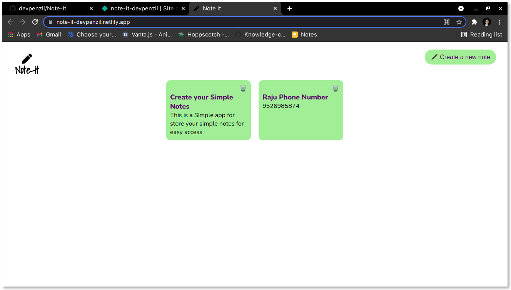

# Note - It

[](https://app.netlify.com/sites/note-it-devpenzil/deploys)

This is a simple Notes saver for browser. You cam bookmark this page and its completely works on localstorage.



## Run Locally

Clone the project

```bash
  https://github.com/devpenzil/Note-It.git
```

Go to the project directory

```bash
  cd Note-It
```

Install dependencies

```bash
  yarn install
```

Start the server

```bash
  yarn start
```

  
## Authors

- [@AjoAlex](https://www.github.com/devpenzil)

  